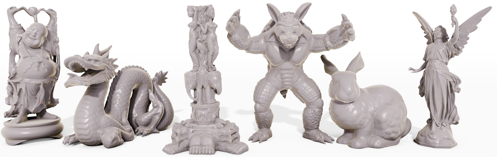

<div align="center">

# RsR: Rotation-System Reconstruction

This is the official implementation of

## Surface Reconstruction Using Rotation Systems <br> (SIGGRAPH ASIA 2024, TOG)


<font size="4">
<a href="https://cuirq3.github.io/" style="font-size:100%;">Ruiqi Cui<sup>1</sup></a>&emsp;
<a href="https://orbit.dtu.dk/en/persons/emil-toftegaard-g%C3%A6de" style="font-size:100%;">Emil Toftegaard Gæde<sup>1</sup> </a>&emsp;
<a href="http://www2.compute.dtu.dk/~erot/" style="font-size:100%;">Eva Rotenberg<sup>1</sup> </a>&emsp;
<a href="https://www.graphics.rwth-aachen.de/person/3/" style="font-size:100%;">Leif Kobbelt<sup>2</sup> </a>&emsp;
<a href="https://people.compute.dtu.dk/janba/" style="font-size:100%;">J. Andreas Bærentzen<sup>1</sup> </a>&emsp;
</font>
<br>

<font size="4">
<sup>1</sup> Department of Applied Mathematics and Computer Science, Technical University of Denmark, Denmark

<sup>2</sup> Visual Computing Institute, RWTH Aachen University, Germany
</font>

| <a href="https://cuirq3.github.io/projects/siga_24/">Webpage</a> | <a href="https://dl.acm.org/doi/10.1145/3687956">Paper</a> | <a href="https://arxiv.org/abs/2402.01893">arXiv</a> | <a href="https://www.youtube.com/watch?v=9DEfhN3pzng">Youtube</a> | <a href="https://www.bilibili.com/video/BV1HzmrY5E6S/">Bilibili</a> |

 <br>
<!-- <b>Our method extracts meshes from 3D Gaussian Splatting reconstructions and builds hybrid representations <br>that enable easy composition and animation in Gaussian Splatting scenes by manipulating the mesh.</b> -->
</div>

# Abstract

_We propose a combinatorial method for reconstruction of surfaces from points. Our method
constructs a spanning tree and a rotation system. Since the tree is trivially
a planar graph, its rotation system determines a genus zero surface with a
single face which we proceed to incrementally refine by inserting edges to
split faces. In order to raise the genus, special handles are added in a later
stage by inserting edges between different faces and thus merging them. It turns out that our approach has two specific benefits over the other methods. First, the output mesh preserves the
most information from the input point cloud. Second, our method provides
control over the topology of the reconstructed surface._

# BibTeX
If you're interested in this work, please cite our paper using the BibTeX entry below.
```
@article{10.1145/3687956,
author = {Cui, Ruiqi and G\ae{}de, Emil Toftegaard and Rotenberg, Eva and Kobbelt, Leif and B\ae{}rentzen, J. Andreas},
title = {Surface Reconstruction Using Rotation Systems},
year = {2024},
issue_date = {December 2024},
publisher = {Association for Computing Machinery},
address = {New York, NY, USA},
volume = {43},
number = {6},
issn = {0730-0301},
doi = {10.1145/3687956},
journal = {ACM Trans. Graph.},
month = nov,
articleno = {190},
numpages = {22},
keywords = {triangle mesh, surface reconstruction, point cloud, graph}
}
```

# Updates and To-do list

<details>
<summary><span style="font-weight: bold;">Updates</span></summary>
<ul>
  <li><b>[09/09/2024]</b> Code release.</li>
</ul>
</details><br>

<details>
<summary><span style="font-weight: bold;">To-do list</span></summary>
<ul>
  <li><b>Integration:</b> Embed our code into Pygel.</li>
  <li><b>Improvement:</b> Remove the reliance on 3rd party libraries.</li>
</ul>
</details>
<br>

# Getting Started
We tested our project on Windows, Linux, and Mac OS. You can find the corresponding installation guide below.

<details>

<summary><strong style="font-size: 1.5em;">&nbsp;Windows</strong></summary>

We recommend using <a href="https://github.com/microsoft/vcpkg?tab=readme-ov-file">VCPKG</a> + <a href="https://cmake.org/">CMake</a> for installation. A good tutorial can be found <a href="https://learn.microsoft.com/vcpkg/get_started/get-started">here</a>. We specify the software and library versions used in our tests, but users are not limited to these versions.

### 0. Prerequisites

All the libs are installed via VCPKG.

- CMake 3.29.0-rc2
- Visual Studio 2019
- VCPKG 
- Libs
  - [CGAL](https://www.cgal.org/download/windows.html) 5.6
  - [Boost](https://www.boost.org/doc/libs/1_86_0/more/getting_started/windows.html)
  - [Eigen3](https://eigen.tuxfamily.org/index.php?title=Main_Page) 3.4.0

### 1. Installing

- Clone the repo.
```
git clone https://github.com/cuirq3/RsR.git
cd RsR
```

- Configure and Generate - replace `path/to/vcpkg` with your local setting, e.g. `C:/vcpkg`
```
mkdir build
cd build
// You can choose compiler by specifying -G argument after cmake command.
cmake -DCMAKE_TOOLCHAIN_FILE=path/to/vcpkg/scripts/buildsystems/vcpkg.cmake -DCMAKE_BUILD_TYPE=Release ..
```
- Build - Manually do it in the IDE or run the following command
```
cmake --build . --config Release
```
- Done! You can jump to [A simple example](#a-simple-example) to test if it is successfully installed.
</details>


<details>

<summary><strong style="font-size: 1.5em;">&nbsp;Linux (Ubuntu)</strong></summary>

### 0. Prerequisites

Install required software and packages:

```
sudo apt install cmake
sudo apt install libcgal-dev
sudo apt install libboost-all-dev
sudo apt install libeigen3-dev
```

### 1. Installing

- Clone the repo.
```
git clone https://github.com/cuirq3/RsR.git
cd RsR
```

- Compile
```
mkdir build
cd build
cmake .. -DCMAKE_BUILD_TYPE=Release
make -j 12
```

- Done! You can go to [A simple example](#a-simple-example) to test if it is successfully installed.

</details>

<details>

<summary><strong style="font-size: 1.5em;">&nbsp;Mac</strong></summary>

We tested with <a href="https://www.macports.org">MacPorts</a> + <a href="https://cmake.org/">CMake</a> for installation. We specify the software and library versions used in our tests, but users are not limited to these versions.

### 0. Prerequisites

Install required software and packages:

```
sudo port install cmake
sudo port install cgal5
sudo port install boost
sudo port install eigen3
```

### 1. Installing

- Clone the repo.
```
git clone https://github.com/cuirq3/RsR.git
cd RsR
```

- Compile
```
mkdir build
cd build
cmake .. -DCMAKE_BUILD_TYPE=Release
make -j 12
```

- Done! You can go to [A simple example](#a-simple-example) to test if it is successfully installed.

</details>
<br>

# A simple example
After installation, a great test would be to reconstruct the well-known [Stanford Bunny](https://graphics.stanford.edu/data/3Dscanrep/). The point cloud is already included in the example folder. You can directly start reconstructing by running the following command.

Note: the commands should follow right after the installation. (Make sure you are at the correct working directory)

Go to the root folder.
```
cd ..
```
... and reconstruct!
```
// For Windows
./build/Release/RsR.exe ./configs/example_config.txt

// For Linux and Mac
./build/RSR ./configs/example_config.txt
```

A reconstructed bunny should be found in the **output** folder.

# Config file
You can modify the config file to adapt the software to different scenarios. The arguments are explained here:

- **root**: the input point cloud file's root folder path
- **model_name**: the file name of the point cloud with file type (e.g. pc.ply). You can specify it as "all" if you want to reconstruct all point cloud files in the root folder
- **out_root**: the output root folder path
- **out_name**: the expected name without suffix (e.g. output)
- **isEuclidean**: if the input point cloud is from a synthetic mesh (not scanned), set this argument to **true** to use Euclidean distance. If it's a scanned point cloud, please set it to false. The program will use projection distance for better performance.
- **isGTNormal**: if the normal is provided in the input file
- **isNoiseExp**: setting this to true will enable the noise experiment (adding random noise to the input). This is a setting for experiment and evaluation of our method. For regular usage, please set it to false.
- **genus**: the expected genus number if you have prior knowledge to the shape. Otherwise, you can comment it and the program will connect handle according to the other argument **n**.
- **k**: the number of neighbors for each vertex to connect in the initial graph. Larger k ensures a sufficient connection but will take longer time to reconstruct.
- **r**: a threshold to remove outlier vertices. If a vertex's connections are all longer than r times of the average edge length in the initial graph, this vertex will be removed from the final reconstruction.
- **theta**: an angle threshold to avoid connecting vertices in different planes.
- **n**: threshold for connecting handles. The edge number of the shortest path in graph should be larger than n for a handle to be considered not a spurious one.
- **isDebug**: by default is false. You can set it to true if you want some intermediate results exported.
# Results reproduction
We provide point cloud files that are synthesized by ourselves in the example folder, and reproduce those results by running the following command for each. For results on other public dataset, please download and write similar config file as we do in the examples.

 - **Teaser**:
 ```
 // For Windows
 ./build/Release/RsR.exe ./configs/teaser_config.txt

 // For Linux and Mac
./build/RSR ./configs/teaser_config.txt
 ```

  - **Pipeline in Fig.6**:
 ```
 // For Windows
 ./build/Release/RsR.exe ./configs/letter_config.txt

  // For Linux and Mac
./build/RSR ./configs/letter_config.txt
 ```

  - **Tree in Fig.12**:

  Due to the large size of the pointcloud, we can't put it in the repo. Please download the [tree](https://drive.google.com/file/d/1JDpMZe5zTz_RJCwGehxiG1B1yT5TbCZK/view?usp=sharing) here and place it at example/tree.obj
 ```
 // For Windows
 ./build/Release/RsR.exe ./configs/tree_config.txt

  // For Linux and Mac
./build/RSR ./configs/tree_config.txt
 ```

  - **Landscape in Fig.12**:
 ```
 // For Windows
 ./build/Release/RsR.exe ./configs/landscape_config.txt

  // For Linux and Mac
./build/RSR ./configs/landscape_config.txt
 ```
# Acknowledgments
We thank all data providers: the Stanford Computer Graphics Laboratory; Qingnan Zhou and Alec Jacobson; Chu et al.; Armeni et al.; Matterport, Inc.; Knapitsch et al.; and Anderson Winkler. We thank the anonymous reviewers for their helpful comments. This work is partially supported by a DTU alliance scholarship, the Danish Council for Independent Research (6111-00552B), the Carlsberg Foundation (CF21-0302), and the German Research Foundation (Gottfried Wilhelm Leibniz programme).

